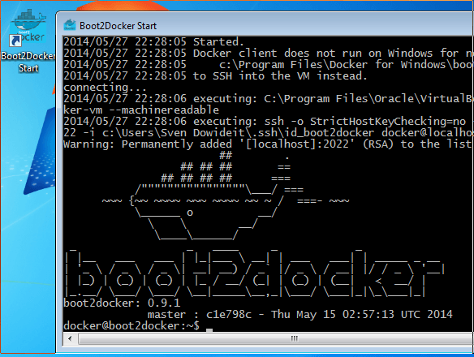

## How to Install Docker

To run Docker on Windows or Mac OS X, you need to install an application called
[Boot2Docker](http://boot2docker.io/). The [official Docker documentation](https://docs.docker.com/) provides clear [installation guides](https://docs.docker.com/installation/#installation) for a variety of platforms. After installing Boot2Docker, you should proceed to the [next section](docker_running_ipynb.md) on how to use INFO 490 Docker container to launch an IPython notebook server.

### Windows

1. Download the latest release of the [Docker for Windows Installer](https://github.com/boot2docker/windows-installer/releases/latest).

2. Run the installer, which will install VirtualBox, MSYS-git, the boot2docker Linux ISO, and the Boot2Docker management tool.

3. Run the `Boot2Docker Start` shell script from your Desktop or Program Files > Boot2Docker for Windows. The Start script will ask you to enter an ssh key passphrase - the simplest (but least secure) is to just hit [Enter].

The Boot2Docker Start script will connect you to a shell session in the virtual machine. If needed, it will initialize a new Virtual Machine (VM) and start it.

### Mac OS X

Please see [Installing Docker on MAC OS
X](https://docs.docker.com/installation/mac/).

### Linux

If you are running Linux on your computer, you probably already know how to
install packages, but if you are not sure, look for you distribution in the
[installation section](https://docs.docker.com/installation/#installation) of
Docker docs.
